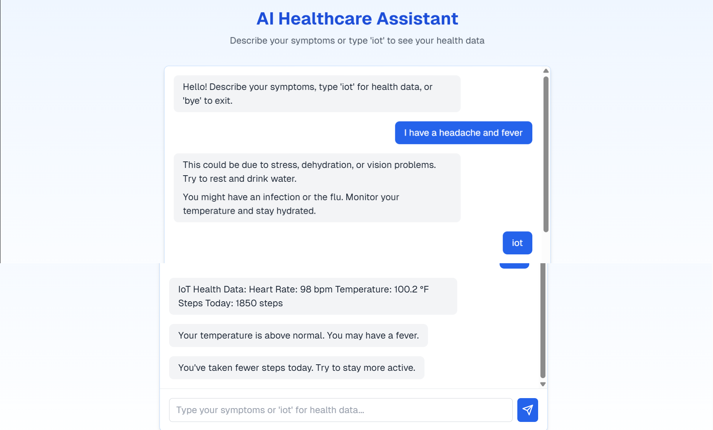

# 🩺 AI Healthcare Chatbot with IoT Simulation

This project is a GUI-based AI Healthcare Chatbot built with Python, Tkinter, and spaCy NLP. The chatbot provides basic health advice based on symptoms and also simulates IoT-based health metrics (heart rate, body temperature, steps taken).

---

## 📋 Features

- 💬 Chatbot interface using `Tkinter`
- 🧠 Symptom extraction using `spaCy` NLP
- 🩺 Responses based on predefined symptom-condition mapping
- 📊 Simulated IoT health data generation (heart rate, temperature, steps)
- 🧾 Suggestions based on health data trends
- 🖼️ Simple GUI chat window with scroll support

---

## 🖥️ Technologies Used

- Python 3.x
- Tkinter (for GUI)
- spaCy (`en_core_web_sm`)
- Random (for IoT data simulation)

---

## 🛠️ Setup Instructions

1. **Install Required Packages**

   ```bash
   pip install spacy
   python -m spacy download en_core_web_sm
   ```

2. **Run the Chatbot**

   ```bash
   python healthcare_chatbot.py
   ```

---

## 💡 Usage

- Start the GUI.
- Enter your symptoms in plain English. Examples:
  - `"I have a headache"`
  - `"I'm feeling shortness of breath"`
- Type `"iot"` to get simulated IoT health data and recommendations.
- Type `"bye"` or `"exit"` to quit the application.

---

## 🧾 Sample Output

```text
Bot: Hello! Describe your symptoms, type 'iot' for health data, or 'bye' to exit.
You: I feel chest pain and fatigue.
Bot: This might be serious. If it persists or is severe, seek emergency care immediately.
Bot: Could be caused by stress, lack of sleep, or a vitamin deficiency. Get enough rest.

You: iot
Bot: IoT Health Data:
  Heart Rate: 108 bpm
  Temperature: 101.4 °F
  Steps Today: 1800 steps
Bot: Your heart rate is elevated. Are you feeling stressed or anxious?
Bot: Your temperature is above normal. You may have a fever.
Bot: You've taken fewer steps today. Try to stay more active.
```

📁 You can save output by redirecting it to a log file, or modify the code to write outputs to a file like `output_log.txt`.

---

## 📸 GUI Preview




---
